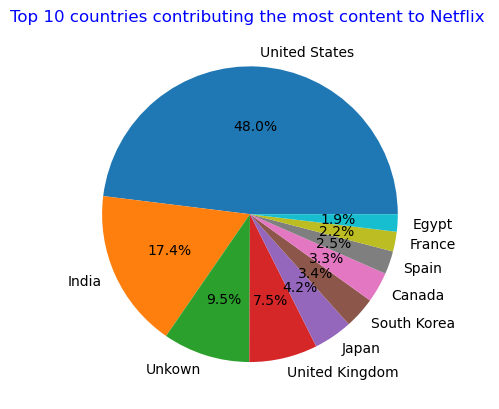

#Netflix data project:
# This project focuses on cleaning data and making the dataset  ready for analysis

#DATA SOURCE
Kaggle
[download here](https://www.kaggle.com/datasets/victorsoeiro/netflix-tv-shows-and-movies)

## Tools used:
-Phython
-Matplotlib
-Pandas
-Jupyter Notebook

##The following steps were performed:
1.Checked data information.
2.Checked sum of duplicates and null values.
3. Replaced null values(NaN) with "Unkown".
4.Replaced missing ratings column with "Not Rated".
5. Removed duplicates.
6. Formatted "Release_Date" as a string since months were initially in words , to handle month names easily.
7.Checked errors and saved the document.
#Visualizations
#Top 10 Countries that contribute the most content to Netflix

## Insight
  This shows that United States,India,Unkown country and United Kingdom contribute the most content on Netflix.
  U.S is the dominant country in this chart which might be due to the fact that Netflix's origins is U.S where 
  the co-founders are located.
# Movies vs Tv Shows

##Insight
Movies are produced more than Tv Shows on Netflix .
## Files added in the repository:
-Netflix Dataset.csv (Original Data)
-Clean_Netflix.csv(Clean data)
-Netflix_Data_Cleaning.ipynb (Cleaning steps)
-Top_countries.png
